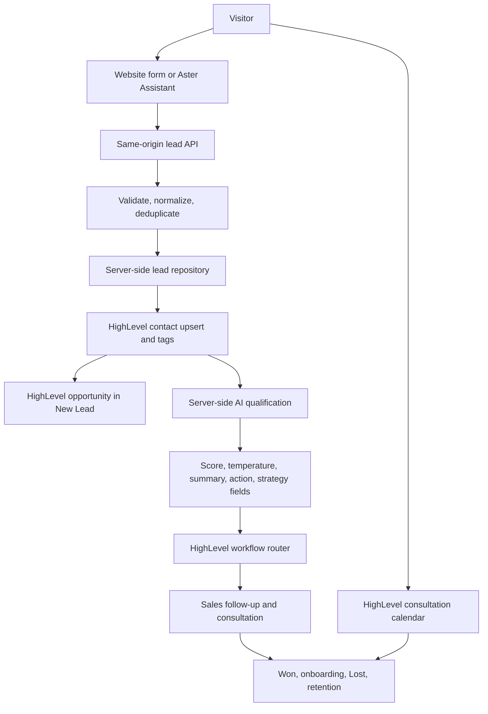

# Aster Homes

Aster Homes is the demonstration implementation for AcquisitionOS (iAcquire): a residential inquiry funnel that captures buyer preferences, creates a contact and opportunity in HighLevel, runs server-side AI qualification, and uses HighLevel workflows for follow-up and lifecycle automation. The public site does not claim licensed-brokerage status or display verified live listings.

## Run locally

Requires Node.js 20.9+ and npm.

```powershell
npm ci
Copy-Item .env.example .env.local
npm run dev
```

Open `http://localhost:3000`. Keep `.env.local` private. For a local UI walkthrough, set `DEMO_MODE=true`. For live HighLevel and AI behavior, set `DEMO_MODE=false` and configure the server-side variables described in `.env.example`. Leads are kept in `.demo-data/leads.json` for this single-server integration demo; replace that store before production-scale deployment.

## Funnel

The landing page and Aster Assistant use the same six-step lead form/API. Contact permission is required to answer the inquiry. Marketing email is a separate, optional, unchecked opt-in. Only explicit opt-ins receive the HighLevel `consent:marketing-email` tag used to gate marketing workflows. The booking page does not require a marketing checkbox.

The consultation CTA opens the public HighLevel calendar. A live synthetic submission has created a HighLevel contact and open opportunity in `01 — New Lead`; the named iAcquire Web Integration is active. IAQ—01 and IAQ—02 are Published after their tag and internal-task actions passed HighLevel synthetic workflow tests. The other 10 workflow records remain Draft/off. IAQ—04, IAQ—05, and IAQ—06 have saved consent, Email DND, Won/customer, and appointment eligibility gates before every marketing send; sender setup and delivery/stop-condition tests remain open. IAQ—12 now requires explicit marketing consent and excludes booked appointments across its three 90-day reactivation branches, while retaining its other eligibility checks; it remains Draft/off and untested. AI qualification and the remaining lifecycle paths have not yet passed a live synthetic end-to-end test. The workflow status shown by the website remains `pending` because HighLevel enrollment is asynchronous and is not falsely reported as delivered.

## Architecture



V1 has no n8n dependency, webhook, callback, or placeholder endpoint. AI credentials stay server-side. The qualification request omits name, email, and phone; its score is a sales-response priority, not a housing, lending, or eligibility decision. Temperature is derived from the score: HOT 70–100, WARM 42–69, COLD 0–41. Budget, financing, location, name, and protected traits do not affect the score.

## Consent and messaging

- `consent_to_contact` is required for the requested inquiry or consultation response.
- `marketing_opt_in` is optional and defaults to `false`.
- HighLevel removes the marketing-consent tag on each website resubmission and adds it only when the current submission expressly opts in. The tag now exists in the iAcquire account.
- IAQ—04, IAQ—05, and IAQ—06 check `consent:marketing-email`, native Email DND, Won/customer status, and appointment status immediately before each marketing send. These workflows remain Draft/off until sender setup and controlled delivery/stop-condition tests pass. Other lifecycle workflows also remain Draft/off pending their own review. Booking confirmations and other requested service messages are handled separately.
- IAQ—12 checks for `consent:marketing-email` and excludes `appointment:booked` contacts in each eligible 90-day reactivation branch. It also preserves DND, Won, disqualified, opt-out, and lost-reason filters. The workflow remains Draft/off; its appointment exclusion depends on the still-unverified IAQ—07 booking-tag path.
- Synthetic testing must use a clearly labeled contact and a reserved test mailbox/number. Keep production opt-in behavior unchanged.

## HighLevel account

The configured iAcquire location includes an Aster Homes pipeline, qualification and attribution fields, consent and lifecycle tags, consultation calendar, message templates, and 12 workflow records. See [the HighLevel integration guide](docs/ghl-aster-homes.md) for the account inventory, workflow purposes, verification state, and any owner actions. Do not copy real contacts, appointments, tokens, or synthetic records into a reusable snapshot.

The internal AcquisitionOS portfolio offer is **$999 one-time setup and $199/month**. Third-party software and usage fees are excluded. Clients own and pay for their third-party accounts directly. This offer is internal and is not displayed on the Aster Homes public site.

## Checks

```powershell
npm run lint
npm run typecheck
npm test
npm run build
```

The source uses Next.js 16.3. Read the repository's local Next.js guides under `node_modules/next/dist/docs/` before changing framework APIs.
